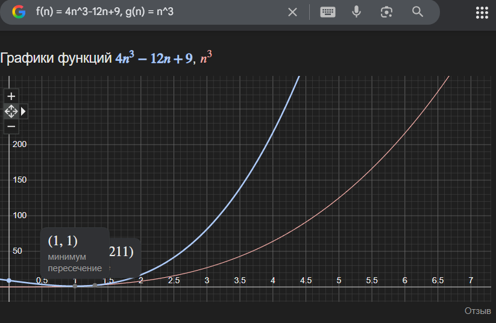
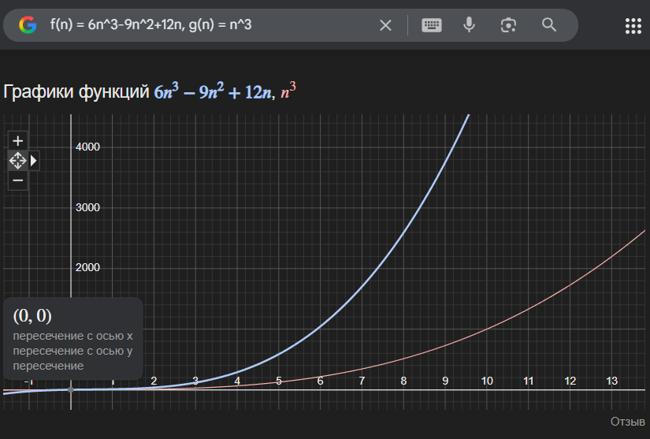

# Практична робота №2. Асимптотична складність алгоритмів. Інші нотації

| 2025.09.25,м.Кременьчук | Створив: Огоновський О.Є. |
| ----------------------- | ------------------------- |

**Мета:** набути практичних навичок у розв’язанні задач на оцінку асимптотичної складності алгоритмів у Ω, Θ, 𝜊, 𝜃, 𝜔-нотаціях.

***

### Завдання 1

Маємо дві функції $f(n)= 4n^3 − 12n + 9, g(n) = n^3$. Довести, що f(n) = Ω(𝑔(𝑛))

---

За визначенням $f(n) = \Omega (g(n))$ якщо існують константи c > 0 та $n_0 in \mathbb{N}$ такі, що:

$f(n) > cg(n)$ для всіх $n \ge n_0$

Розглянемо $f(n)$:  
$f(n) = 4n^3 - 12n + 9 = n^3 +(3n^3 - 12n) + 9$

Зауважимо, що 
$3n^3 - 12n = 3n(n^2 - 4) > 0$ для $n > 2$

для всіх $n \ge 3$ маємо $3n^3 - 12 \ge 0$, а тому
$f(n) = n^3 + (3n^3 -12n)+9 \ge n^3 + 9 \ge 1 \cdot n^3$

Отже можна вяти c = 1 та $n_0 = 3$. тому $f(n) \ge cg(n)$ для всіх $n \ge n_0$, тобто $f(n) = \Omega (g(n))$

Видно що для $n \ge 3$ синя крива лежить вище червоної

### Завдання 6

Нехай $f(n) = 6n^3 - 9 n^2 + 12n$ і $g(n) = n^3$. Довести, що f(n) = Ω(𝑔(𝑛)).

---

Розкладаємо: 
$f(n) = 6n^3 - 9n^2 + 12n = n^3 + (5n^3 - 9n^2 +12)$

Розглянемо додатковий множник:

$5n^3 - 9n^2 + 12n = n(5n^2 - 9n + 12)$

Квадратний тричлен 5n^3 - 9n + 12 має дискримінант:

$\Delta = (-9)^2 - 4 \cdot 5 \cdot 12 = 81 -240 = -159 < 0$

тому для всіх $n \in \mathbb{R}$ цей тричлен додатний. Отже для всіх натуральних $n \ge 1$
$5n^3 - 9n^2 + 12n \ge 0$

$f(n) = n^3 + (5n^3 - 9 n^2 + 12n) \ge n^3$

можемо взяти c = 1 і $n_0 = 1$. Тому $f(n) \ge cg(n)$для всіх $n \ge n_0$, тобто $f(n) = \Omega (g(n))$

Синя крива завжди вище червоної вже з n = 1

### Контрольні питання

1. Що таке асимптотична складність алгоритму?
   Асимптотична складність — це спосіб оцінки ефективності алгоритму шляхом аналізу того,як час виконання (часова складність) або обсяг пам'яті (просторова складність) змінюються зі збільшенням розміру вхідних даних.

2. Які інші нотації, крім O-нотації, використовуються для вираження асимптотичної складності?
   Основні нотації:
   
   - O (велике О) - асимптотична верхня межа
   - $\Omega$ - асимптотична нижня межа
   - $\Theta$ - Коли одночасно є й верхня, й нижня межа
   - o (меленьке о) - функція росте строго повільніше
   - $\omega$ (маленька %\omega$) - функція росту строго швидше

3. Як визначити асимптотичну складність алгоритму за допомогою символів $\Theta$ і $\Omega$ ?
   
   - $\Omega$: $f(n) = \Omega (g(n))$ означає - існують c > 0 і $n_0$ такі, що для всіх $n \ge n_0$ виконано $f(n) \ge cg(n)$. Тобто g(n) - асимптотична нижня межа для  $f(n)$.
   - $\Theta$: $f(n) = \Theta (g(n))$ означає - існують $c_1$, $c_2 > 0 $  і $n_0$ такі, що $c_1 g(n) \le  f(n) \le c_2 g(n)$ для всіх $n \ge n_0$. Тобто f і g зростають однаково за порядком

4. Яка різниця між О-нотацією, $\Theta$-нотацією і $\Omega$-нотацією?
   
   - O(g(n)) - стверджує, що f(n) не перевищує (в асимптотичному сенсі) сталого кратного від g(n) (верхня оцінка).
   - $\Omega$(g(n)) - стверджує, що f(n) не менша (в асимптотичному сенсі) від сталого кратного g(n) (нижня оцінка).
   - $\Theta$(g(n)) - означає одночасно $f(n)= O(g(n))$ і $f(n)= \Omega (g(n))$; тобто g є і верхньою, і нижньою межею — точний порядок росту.

5. Які основні властивості інших нотацій, таких як o (маленька о), $\omega$(маленька омега) 
   
   - f(n) = o(g(n)) означає $\lim\limits_{x \to \infty} {{f(n)} \over {g(n)}} = 0$. Тобто f зростає строго повільніше за g
   - f(n) = $\omega$ (g(n)) означає $\lim\limits_{x \to \infty} {{f(n)} \over {g(n)}} = + \infty$. Тоді f зростая строго швидше.
     Властивості:
   - якщо $f = \Theta (g)$ то $f = O(g)$ і $f = \Omega (g)$.
   - якщо $f = o(g) $, то $f = O(g)$
   - якщо $f = \omega (g) $ то $f = \Omega (g)$

