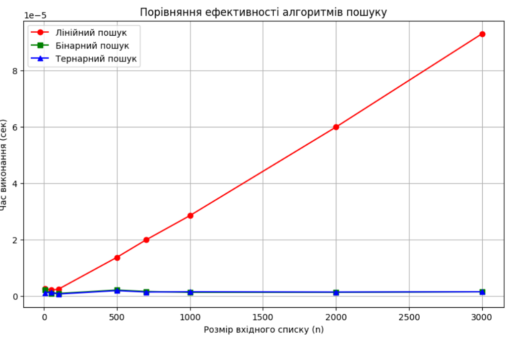
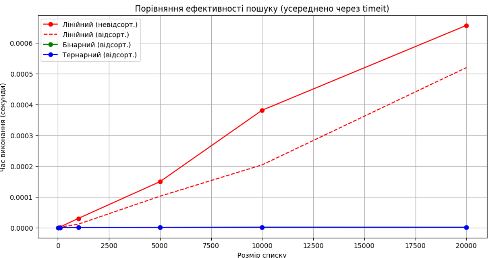

# Практична робота №4. Алгоритми пошуку та їх складність

| 2025.10.27,м.Кременьчук | Створив: Огоновський О.Є. |
| ----------------------- | ------------------------- |

**Мета:** опанувати основні алгоритми сортування та навчитись методам аналізу їх асимптотичної складності.

***

### Завдання 1

Оцінити асимптотичну складність алгоритму лінійного пошуку у 𝑂-нотації в найгіршому і в найкращому випадку. Як можна покращити алгоритм лінійного пошуку?

---

```python
def linear_search(a_list, x):
    i, length = 0, len(a_list)
    while i < length and x != a_list[i]:
        i += 1
    return i if i < length else -1 
```

У найгіршому випадку: O(n)

У найкращому випадку: O(1)

Алгоритм можна покращити попередньо його відсортувавши

### Завдання 2

Оцінити асимптотичну складність алгоритму бінарного пошуку у 𝑂-нотації в найгіршому і в найкращому випадку.

---

```python
def binary_search(arr, x):
    left, right = 0, len(arr) - 1
    while left <= right:
        mid = (left + right) // 2
        if arr[mid] == x:
            return mid
        elif arr[mid] < x:
            left = mid + 1
        else:
            right = mid - 1
    return -1
```

В найгіршому випадку складність O(log2 n) - в цьому випадку елемент відсутній, або він знаходиться в кінці масиву(або початку). В найкрашому випадку складність O(1) - елемент знаходиться в середині масиву

### Завдання 3

Побудувати алгоритм тернарного пошуку і оцінити його асимптотичну складність алгоритму у 𝑂-нотації в найгіршому і в найкращому випадку. Який з алгоритмів є оптимальнішим: бінарний, чи тернарний? Обґрунтувати відповідь відповідними обчисленнями.

---

```python
def ternary_search(arr, x):
    left, right = 0, len(arr) - 1
    while left <= right:
        third = (right - left) // 3
        mid1 = left + third
        mid2 = right - third

        if arr[mid1] == x:
            return mid1
        if arr[mid2] == x:
            return mid2

        if x < arr[mid1]:
            right = mid1 - 1
        elif x > arr[mid2]:
            left = mid2 + 1
        else:
            left = mid1 + 1
            right = mid2 - 1
    return -1
```

В найгіршому випадку складність буде O(log3 n) - масив ділиться на 3 частини та перевіряє одначасно два елементи найгіршими випадками будуть або відсутність , або присутність у кінці(або початку).В найкращому O(1) - знову ж таки тому що знаходиться в місці розтину масиву.

$log_2 n < log_3 n$ => **бінарний ефективніший**.

### Завдання 4

 Порівняти ефективність алгоритмів лінійного, бінарного та тернарного пошуку для різних розмірів вхідного списку. Для цього провести експериментальне дослідження та побудувати графіки залежності часу виконання алгоритму від розміру вхідного списку.

---

```python
import time
import matplotlib.pyplot as plt
import numpy as np

def linear_search(arr, x):
    for i in range(len(arr)):
        if arr[i] == x:
            return i
    return -1

def binary_search(arr, x):
    left, right = 0, len(arr) - 1
    while left <= right:
        mid = (left + right) // 2
        if arr[mid] == x:
            return mid
        elif arr[mid] < x:
            left = mid + 1
        else:
            right = mid - 1
    return -1

def ternary_search(arr, x):
    left, right = 0, len(arr) - 1
    while left <= right:
        third = (right - left) // 3
        mid1 = left + third
        mid2 = right - third
        if arr[mid1] == x:
            return mid1
        if arr[mid2] == x:
            return mid2
        if x < arr[mid1]:
            right = mid1 - 1
        elif x > arr[mid2]:
            left = mid2 + 1
        else:
            left = mid1 + 1
            right = mid2 - 1
    return -1

sizes = [10, 50, 100, 500, 700, 1000, 2000, 3000]
linear_times = []
binary_times = []
ternary_times = []

for n in sizes:
    arr = list(range(n))
    x = n - 1

    start = time.perf_counter()
    linear_search(arr, x)
    linear_times.append(time.perf_counter() - start)

    start = time.perf_counter()
    binary_search(arr, x)
    binary_times.append(time.perf_counter() - start)

    start = time.perf_counter()
    ternary_search(arr, x)
    ternary_times.append(time.perf_counter() - start)

plt.figure(figsize=(10, 6))
plt.plot(sizes, linear_times, label="Лінійний пошук", marker='o', color='red')
plt.plot(sizes, binary_times, label="Бінарний пошук", marker='s', color='green')
plt.plot(sizes, ternary_times, label="Тернарний пошук", marker='^', color='blue')
plt.xlabel("Розмір вхідного списку (n)")
plt.ylabel("Час виконання (сек)")
plt.title("Порівняння ефективності алгоритмів пошуку")
plt.legend()
plt.grid(True)
plt.show()
```



Ми бачимо , що бінарний та тернарний пошук набагато швидше за лінійний пошук. Лінійний пошук може дати хоч трохи схожий результат лише на дуже малих n.

### Завдання 5

Порівняти алгоритми пошуку за їхньою здатністю працювати з відсортованими та не відсортованими списками. Провести аналіз впливу відсортованості списку на час виконання кожного алгоритму.

---

```python
import random
import timeit
import matplotlib.pyplot as plt

def linear_search(arr, x):
    for i in range(len(arr)):
        if arr[i] == x:
            return i
    return -1

def binary_search(arr, x):
    left, right = 0, len(arr) - 1
    while left <= right:
        mid = (left + right) // 2
        if arr[mid] == x:
            return mid
        elif arr[mid] < x:
            left = mid + 1
        else:
            right = mid - 1
    return -1

def ternary_search(arr, x):
    left, right = 0, len(arr) - 1
    while left <= right:
        third = (right - left) // 3
        mid1 = left + third
        mid2 = right - third
        if arr[mid1] == x:
            return mid1
        if arr[mid2] == x:
            return mid2
        if x < arr[mid1]:
            right = mid1 - 1
        elif x > arr[mid2]:
            left = mid2 + 1
        else:
            left = mid1 + 1
            right = mid2 - 1
    return -1

def time_function(func, arr, x, number=10):
    return timeit.timeit(lambda: func(arr, x), number=number) / number

sizes = [10, 100, 1000, 5000, 10000, 20000]
lin_unsorted_times = []
lin_sorted_times = []
bin_sorted_times = []
ter_sorted_times = []

for size in sizes:
    unsorted_list = [random.randint(0, size) for _ in range(size)]
    sorted_list = sorted(unsorted_list)
    target = unsorted_list[-1]  

    lin_unsorted_times.append(time_function(linear_search, unsorted_list, target))
    lin_sorted_times.append(time_function(linear_search, sorted_list, target))
    bin_sorted_times.append(time_function(binary_search, sorted_list, target))
    ter_sorted_times.append(time_function(ternary_search, sorted_list, target))

plt.figure(figsize=(12, 6))
plt.plot(sizes, lin_unsorted_times, 'r-o', label='Лінійний (невідсорт.)')
plt.plot(sizes, lin_sorted_times, 'r--', label='Лінійний (відсорт.)')
plt.plot(sizes, bin_sorted_times, 'g-o', label='Бінарний (відсорт.)')
plt.plot(sizes, ter_sorted_times, 'b-o', label='Тернарний (відсорт.)')
plt.xlabel('Розмір списку')
plt.ylabel('Час виконання (секунди)')
plt.title('Порівняння ефективності пошуку (усереднено через timeit)')
plt.legend()
plt.grid(True)
plt.show()
```



Відсортований лінійний алгоритм в середньому швидше працює за свою невідсортовану версію , але все ще повільніше за бінарний та тернарний пошук.

### Завдання 6

 Розглянути сценарії використання кожного з алгоритмів пошуку у практичних задачах і обґрунтувати вибір кожного алгоритму в конкретному випадку.

---

1. Лінійний пошук.
   лінійний пошук не потребує сортування списку та погано працює з великими об'ємами даних , тому з цього маємо , що якщо якесь завдання не потребує сортування та потрібно опрацювати невелику кількість даних то лінійний пошук підійде добре.Як приклад можна взяти список тих хто брав книжку в бібліотеці , не має потреби його сортувати тому що тоді затратиться ще більше часі ніж просто пройтись по кожному імені та фамілії.

2. Бінарний пошук.
   Цей пошук використовується лише в відсортованих списках , доцільним відстортовувати список для викорстання цього пошуку буде лише тоді , коли даних дуже багато.Як приклад можемо взять пошук слова у словнику , він відсортований за першою буквою слова та самих слів там дуже багато.

3. Тернарний пошук.
   Дуже схожий на бінарний пошук , але трохи повільніший.Це не заважає йому мати власну область застосування, є корисним при аналізі мінімумів та максимумів унімодальних функцій.

### Контрольні питання

1. **Що таке алгоритм пошуку і чому він важливий у контексті комп'ютерних наук?**
    алгоритм пошуку використовують для пошуку певного елемента ( або його індекса ) у певному списку.Для комп'ютерний наук він є важливим тому що він часто є основою для складніших алгоритмів , а також часто використовуються для вирішення певних задач

2. **Які основні критерії оцінки ефективності алгоритмів пошуку?**
    асимптотична складність , оптимальність , складність реалізації , умови застосування.

3. **Що таке лінійний пошук, і як він працює?**
    Лінійний пошук це один з алгортимів пошуку який можна використовувати як у відсортованому списку так і не відсортованому списку.Лінійний пошук послідовно переглядає кожен елемент зі списку та порівнює з шуканим значенням до тих пір поки не знайде шукане значення або не дійде до кінця.

4. **Які умови повинні бути виконані для успішного застосування бінарного пошуку?**
    основною умовою є те , що список повинен бути попередньо відсортованим.

5. **Які переваги та недоліки використання бінарного пошуку порівняно з іншими алгоритмами пошуку?**
    Переваги: 
   
   - Швидкість (O(log n)) 
   
   - він гарно працює з великою кількістю даних.
     
     Недоліки : 
   
   - потрібно попередньо сортувати список, більш складна реалізація, якщо мала кількість даних доречніше буде використати інший алгоритм пошуку.

6. **Що таке тернарний пошук, і в чому його відмінність від бінарного пошуку?**
     Тернайрний пошук це один з алгоритмів пошуку , який потребує щоб список було попередньо відсортовано , зазвичай використовується для пошук мінімумів та максимумів унімодальних функцій.
     Головна відмінність від бінарного пошуку полягає в тому , що замість розбиття списку на 2 частини , тернарний пошук розбиває його на 3 та порівнює одночасно 2 елементи замість 1 .
