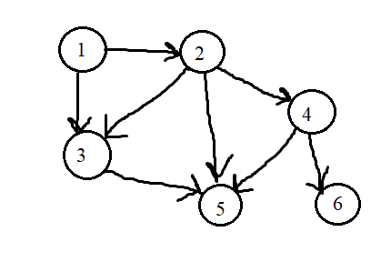

# Практична робота №5. Графи. Ациклічні графи

| 2025.11.07,м.Кременьчук | Створив: Огоновський О.Є. |
| ----------------------- | ------------------------- |

**Мета:** набути практичних навичок розв’язання задач топографічного сортування та оцінювання їх асимптотичної складності.

***

### Задача для самостійного розв’язання

16. Задано ациклічний граф: 1,2,3,4,5,6}{(1,2),(1,3),(2,4),(2,3),(2,5),(3,5),(4,5),(4,6)}. Побудувати граф і розв’язати задачу топологічного сортування за допомогою алгоритму DFS.

#### Побудова графу

Задані вершини: {1, 2, 3, 4, 5, 6}. 

Задані дуги: (1,2);(1,3);(2,4);(2,3);(2,5);(3,5);(4,5);(4,6).

Граф має таких сусідів (вершина => [сусіди]):

1 => [2, 3]

2 => [4, 3, 5]

3 => [5]

4 => [5, 6]

5 => []

6 => []

<!--Матриця суміжності:
011000 
001110 
000010 
000011 -->

#### Топологічне сортування за допомогою алгоритму DFS.

Відвідані: Множина вершин, які ми вже відвідали.

Результат: Список, який буде містити вершини в зворотному порядку завершення DFS.

---

- dfs(1)
    Позначаємо 1 як відвідану.
    Сусіди 1: [2, 3]. Спочатку йдемо в 2.
  
  - dfs(2)
      Позначаємо 2 як відвідану.
      Сусіди 2: [4, 3, 5]. Спочатку йдемо в 4.
    
    - dfs(4)
      Позначаємо 4 як відвідану.
      Сусіди 4: [5, 6]. Спочатку йдемо в 5.
      
      - dfs(5)
          Позначаємо 5 як відвідану.
          Сусіди 5: []. Немає сусідів.
          **Завершуємо dfs(5) і додаємо 5 в результат. Результат: [5]**
      
      - Повертаємося до dfs(4). Наступний сусід 4 - це 6.
        
        - dfs(6)
            Позначаємо 6 як відвідану.
            Сусіди 6: []. Немає сусідів.
            **Завершуємо dfs(6) і додаємо 6 в результат. Результат: [5, 6]**
      
      - Всі сусіди 4 оброблені.
      
      - **Завершуємо dfs(4) і додаємо 4 в результат. Результат: [5, 6, 4]**
  
  - Повертаємося до dfs(2). Наступний сусід 2 - це 3.
  
  - dfs(3)
      Позначаємо 3 як відвідану.
      Сусіди 3: [5]. Перевіряємо 5. Вершина 5 вже відвідана, тому не запускаємо dfs(5).
      Всі сусіди 3 оброблені.
      **Завершуємо dfs(3) і додаємо 3 в результат. Результат: [5, 6, 4, 3]**
  
  - Повертаємося до dfs(2). Останній сусід 2 - це 5. Вершина 5 вже відвідана, тому ігноруємо.
    Всі сусіди 2 оброблені.
    **Завершуємо dfs(2) і додаємо 2 в результат. Результат: [5, 6, 4, 3, 2]**

- Повертаємося до dfs(1). Наступний сусід 1 - це 3. Вершина 3 вже відвідана, тому ігноруємо.
    Всі сусіди 1 оброблені.
    **Завершуємо dfs(1) і додаємо 1 в результат. Результат: [5, 6, 4, 3, 2, 1]**

#### Фінальний результат(розвернутий): [1, 2, 3, 4, 6, 5].

### Контрольні питання

1. **Які переваги і недоліки алгоритму Кана порівняно з алгоритмом DFS для топологічного сортування графа?** 
    алгоритм Кана є ефективнішим для густо зв'язаних графів , а з недоліків , DFS краще для розріджених графів з меншою кількістю вершин.

2. **Яка складність часу і пам’яті для кожного з алгоритмів у найгіршому і найкращому випадках?** 
    DFS : Найгірший випадок - Часова = O(V+E) Пам'яті = O(V) Найкращий випадок - Часова = O(1) Пам'яті = O(1). Кана : Найгірший випадок - Часова = O(V+E) Пам'яті = O(V+E) Найкращий випадок - Часова = O(V+E) Пам'яті = O(V+E) У Кана ми всеодно проходимо весь граф.

3. **Чи можна застосовувати алгоритм Кана до графів з вагами на ребрах? Як це порівняти з DFS?** 
    Алгоритм Кана не можна використовувати для графів з вагами , бо він оперує лише структурою графа.DFS можна використовувати для графів з вагами на ребрах , але звичайно краще буде використати інші алгоритми для цього.

4. **Як впливає структура графа на швидкість роботи кожного з цих алгоритмів?**
    Структура графа має значний вплив на фактичний час виконання DFS. Розріджені та деревоподібні графи обробляються швидше, ніж щільні або глибокі графи.Для алгоритму Кана структура не змінює його асимптотичну складність

5. **Чи є обмеження використання кожного алгоритму для певних типів графів або завдань?**
    DFS погано працює з знаходженням найкоротших шляхів у графі , та у тих завданнях що вимагають обходу графа в певному порядку, відмінному від порядку від глибшого до першого. Кана не працює з графами що мають цикли , неорієнтовних графах , в задачах з вагою ребер.

6. **Які варіанти оптимізації можна застосувати для кожного алгоритму з метою поліпшення його продуктивності?** 
    Для DFS можна покращити порядок сусудів або зробити паралелізацію (якщо структура це дозволяє).Для Кана можна використати списки суміжності або також зробити паралелізацію , знову ж таки якщо це можливо.
