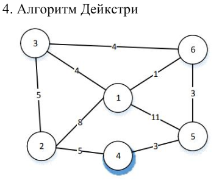

# Практична робота №6. Графи. Найкоротші шляхи

| 2025.11.07,м.Кременьчук | Створив: Огоновський О.Є. |
| ----------------------- | ------------------------- |

**Мета:** набути практичних навичок розв’язання задач пошуку найкоротших шляхів у графі та оцінювання їх асимптотичної складності.

***

## Задача для самостійного розв’язання

Завдання полягає у знаходженні найкоротших шляхів від вершини 1 до всіх інших за допомогою алгоритму, вказаному у варіанті

### Перший крок алгоритму

Завдання полягає у знаходженні найкоротших шляхів від вершини 1 до всіх інших за допомогою алгоритму, Дейкстри

| 1        | 2        | 3        | 4        | 5        | 6        |
| -------- | -------- | -------- | -------- | -------- | -------- |
| 0        | 8        | 4        | $\infty$ | 11       | 1        |
| 8        | 0        | 5        | 5        | $\infty$ | $\infty$ |
| 4        | 5        | 0        | $\infty$ | $\infty$ | 4        |
| $\infty$ | 5        | $\infty$ | 0        | 3        | $\infty$ |
| 11       | $\infty$ | $\infty$ | 3        | 0        | 3        |
| 1        | $\infty$ | 4        | $\infty$ | 3        | 0        |

 

d=[0,∞,∞,∞,∞,∞]

Перевіряємо сусіди вершини 1:

1→2: 8 → d[2] = 8

1→3: 4 → d[3] = 4

1→5: 11 → d[5] = 11

1→6: 1 → d[6] = 1

d=[0,8,4,∞,11,1]

Відвідані: {1}

### Обираємо найближчу невідвідану вершину 6

Мінімум серед невідвіданих (2,3,4,5,6):

d[6] = 1 — мінімальне.

Сусіди вершини 6:

6→1: вже відвідана

6→3: 4. Поточна d[3] = 4. Через 6: d[6]+4 = 1+4=5 — не покращує.

6→5: 3. d[5] = 11. Через 6: 1+3=4 — покращує.

Оновлюємо: d[5] = 4.

d=[0,8,4,∞,4,1]

Відвідані: {1, 6}

### Обираємо найближчу невідвідану вершину 3

Мінімум: d[3] = 4, d[5] = 4 — обираємо 3.

Відвідуємо вершину 3.

Сусіди вершини 3:

3→1: відвідана

3→2: 5. d[2] = 8. Через 3: 4+5=9 — не покращує.

3→6: відвідана

Змін немає.

d=[0,8,4,∞,4,1]

Відвідані: {1, 6, 3}

### Обираємо найближчу невідвідану вершину 5

Мінімум: d[5] = 4.

Сусіди вершини 5:

5→1: відвідана

5→4: 3. d[4] = ∞. Через 5: 4+3=7 → d[4] = 7

5→6: відвідана

Оновлюємо: d[4] = 7.

d=[0,8,4,7,4,1]

Відвідані: {1, 6, 3, 5}

### Обираємо найближчу невідвідану вершину 4

Мінімум: d[2] = 8, d[4] = 7 → обираємо 4.

Сусіди вершини 4:

4→2: 5. d[2] = 8. Через 4: 7+5=12 — не покращує.

4→5: відвідана

Змін немає.

### Залишилась вершина 2

Відвідуємо вершину 2.

Сусіди вершини 2:

2→1: відвідана

2→3: відвідана

2→4: відвідана

Змін немає.

d=[0,8,4,7,4,1]

Відвідані: {1, 6, 3, 5, 4}

## Контрольні питання

1. **1. Що таке граф і які головні складові його структури?**
    Граф — це математична структура, яка складається з вершин (або вузлів) і ребер.
   
    **Головні складові графа:**
   
   - Вершини (V) — об’єкти, між якими встановлюються зв’язки.
   
   - Ребра (E) — з’єднання між парами вершин. Можуть бути:
     
     - орієнтованими (дуги) — зв’язок має напрямок;
     - неорієнтованими — зв’язок не має напрямку.
     - Вага ребра — числове значення, що відображає “вартість” переходу від однієї вершини до іншої (опціонально).
     
     **Структури подання графа:**
   
   - матриця суміжності;
   
   - список суміжності;
   
   - матриця інцидентності.

2. Які алгоритми використовуються для пошуку найкоротших шляхів у графах?
   
    **Найпоширеніші алгоритми:**
   
   - Алгоритм Дейкстри — для графів без від’ємних ваг.
   - Алгоритм Беллмана–Форда — працює з від’ємними вагами; дозволяє виявити від’ємні цикли.
   - Алгоритм Флойда–Воршелла — знаходить найкоротші шляхи між усіма парами вершин.

3. Як працює алгоритм Дейкстри і які його особливості?
   
    **Принцип роботи:**
   
   - Починаємо з початкової вершини, встановлюємо відстань до неї 0, до решти — нескінченність.
   - Вибираємо вершину з найменшою відстанню, оновлюємо відстані до її сусідів.
   - Повторюємо, поки не обійдемо всі вершини.
   
   **Особливості:**
   
   - Працює тільки для графів без від’ємних ваг.
   - Ефективний для знаходження найкоротших шляхів від однієї вершини до всіх інших.
   - Складність: 𝑂((𝑉 + 𝐸) log 𝑉) з чергою з пріоритетом (heap).

4. Що таке алгоритм Белмена–Форда і коли його варто застосовувати?
    Алгоритм Беллмана–Форда також знаходить найкоротші шляхи від однієї вершини до всіх інших, але дозволяє наявність від’ємних ваг.
   
   **Принцип роботи:**
   
   1. Ініціалізуємо відстані як у Дейкстри.
   2. Виконуємо |𝑉| − 1 ітерацій, на кожній "розслаблюючи" всі ребра — оновлюємо відстані, якщо знайдено коротший шлях.
   3. Після всіх ітерацій перевіряємо, чи немає негативного циклу.
   
   **Переваги:**
   
   - Працює з від’ємними ребрами.
   - Може виявити наявність циклів з від’ємною вагою.
     Недоліки:
   - Працює повільніше, ніж алгоритм Дейкстри: 𝑂(|𝑉| × |𝐸|).

5. Як працює алгоритм Флойда–Форшала і які його переваги та недоліки?
    Алгоритм Флойда–Форшала (часто пишуть Флойда–Воршелла) знахоить найкоротші шляхи між усіма парами вершин графа.
   
   **Принцип роботи:**
   
   - Використовує динамічне програмування.
   - Ітеративно покращує оцінки шляхів між усіма вершинами, перевіряючи, чи існує проміжна вершина, через яку шлях коротший.
   
   **Суть:**
   
     Для кожної пари вершин (i, j), перевіряємо, чи можна покращити шлях через третю вершину k: distance[i][j] = min(distance[i][j], distance[i][k] + distance[k][j])
   
   **Переваги:**
   
   - Простий у реалізації.
   - Дає найкоротші шляхи між всіма парами вершин.
   - Працює з від’ємними вагами (якщо немає циклів з від’ємною вагою).
     Недоліки:
     - Висока складність: 𝑂(|𝑉 3|) — повільний для великих графів
