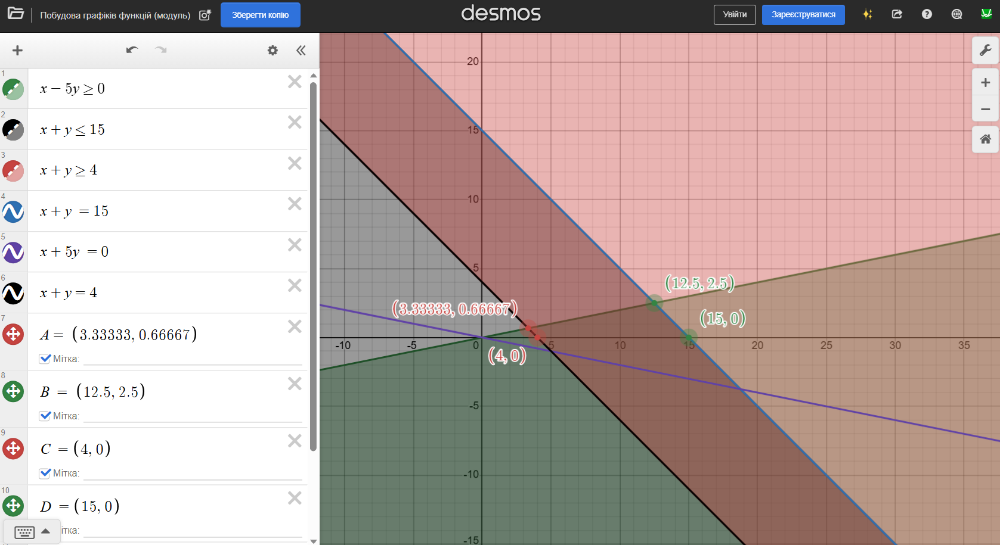

# Практична робота №1. Лінійне програмування

| 2025.12.08,м.Кременьчук | Створив: Огоновський О.Є. |
| ----------------------- | ------------------------- |

**Мета:** Засвоєння графічного методу розв’язку задачі лінійного
програмування.

---

## **1. Обмеження та їх геометричний опис**

Маємо систему:

$
\begin{cases}
x_1 - 5x_2 \ge 0 & (1) \\
x_1 + x_2 \le 15 & (2) \\
x_1 + x_2 \ge 4 & (3) \\
x_1 \ge 0 & (4) \\
x_2 \ge 0 & (5)
\end{cases}
$

### **1.1. Окремо намалюємо кожну пряму та півплощину:**

## **2. Перетин усіх обмежень**

Система (1)+(2)+(3)+(4)+(5):

Візьмемо $( x_2 \le x_1/5 )$ і $( 4 \le x_1 + x_2 \le 15 )$, $( x_1, x_2 \ge 0 )$.

Пряма $( x_2 = x_1/5 )$ і пряма $( x_1 + x_2 = 4 )$ перетинаються:  
$( x_1 + x_1/5 = 4 )$  
$( (6/5) x_1 = 4 )$  
$( x_1 = 10/3 \approx 3.333 )$, $( x_2 = (10/3)/5 = 2/3 \approx 0.667 )$.  
Точка $( A\left(\frac{10}{3}, \frac{2}{3}\right) )$.

Пряма $( x_2 = x_1/5 )$ і пряма $( x_1 + x_2 = 15 )$ перетинаються:  
$( x_1 + x_1/5 = 15 )$  
$( (6/5) x_1 = 15 )$  
$( x_1 = 75/6 = 25/2 = 12.5 )$, $( x_2 = (12.5)/5 = 2.5 )$.  
Точка $( B\left(\frac{25}{2}, \frac{5}{2}\right) )$.

Окремо перетин $( x_1 + x_2 = 4 )$ з $( x_2 = 0 )$ — точка $( C(4,0) )$. Але чи належить вона області $( x_1 \ge 5x_2 )$ 

$( x_2=0 )$ завжди задовольняє $( x_1\ge 0 )$. Але обмеження (1) дає $( x_2 \le x_1/5 )$, при $( x_2=0 )$ це $( 0 \le x_1/5 )$, тобто $( x_1 \ge 0 )$ (і так є). Точка $( C )$ належить.

---

Отже вершини багатокутника розв’язків:

1. $( A\left(\frac{10}{3},\frac{2}{3}\right) )$ — перетин (1) і (3)  
2. $( B\left(\frac{25}{2}, \frac{5}{2}\right) )$ — перетин (1) і (2)  
3. $( C(4,0) )$ — перетин (3) і $( x_2=0 )$ (з умови $( x_1\ge 5x_2 )$ перевірено)  
4. $( D(15,0) )$ — перетин (2) і $( x_2=0 )$ (з умови $( x_1\ge 5x_2 )$ перевірено)

Чи замкнений багатокутник? Перевіримо ребра:  
Від C до D: відрізок $( x_2=0, 4 \le x_1 \le 15 )$  
Від D до B: відрізок на $( x_1+x_2=15 )$ від $( x_2=0 )$ до $( x_2=2.5 )$  
Від B до A: відрізок на $( x_1-5x_2=0 )$ від $( x_1=12.5 )$ до $( x_1=10/3 )$  
Від A до C: відрізок на $( x_1+x_2=4 )$ від $( x_1=10/3 )$ до $( x_1=4 )$

Бачимо, що $( x_1 )$ спадає від D до B до A, потім зростає до C і до D. Замкнений.

---

## **3. Цільова функція**

$
F = x_1 - 5x_2
$

Градієнт $( \nabla F = (1,-5) )$.  
Лінії рівня: $( x_1 - 5x_2 = const )$ — ті ж самі, що і пряма (1), але тепер рухаємо паралельно їй.

---

Оскільки обмеження (1) каже $( x_1 - 5x_2 \ge 0 )$, тобто $( F \ge 0 )$ у всій допустимій області.  

У точці A: $( x_1 - 5x_2 = \frac{10}{3} - 5 \cdot \frac{2}{3} = \frac{10}{3} - \frac{10}{3} = 0 )$.  
У точці B: $( \frac{25}{2} - 5 \cdot \frac{5}{2} = \frac{25}{2} - \frac{25}{2} = 0 )$.

Тобто вся пряма $( x_1 - 5x_2 = 0 )$ від A до B — це ребро багатокутника, і на цьому ребрі $( F = 0 )$.

У точці C: $( F = 4 - 0 = 4 )$.  
У точці D: $( F = 15 - 0 = 15 )$.

---

Напрям зростання $( F )$ — це напрям вектора (1,-5). Подивимось на точку C (4,0): якщо рухатися вздовж $( x_2=0 )$ до D, то $( F )$ зростає від 4 до 15. Якщо рухатися від C до A вздовж $( x_1+x_2=4 )$, то $( x_2 )$ зростає, $( x_1 )$ спадає — $( F = x_1-5x_2 )$ швидко спадає до 0.  

Мінімум $( F )$ на області:  
Оскільки $( F \ge 0 )$ за обмеженням (1), і на ребрі A–B досягається 0, то мінімум $( F = 0 )$ на всьому відрізку A–B.

Максимум: найбільше $( F )$ на вершинах C (4) і D (15). На стороні C–D лінійно зростає з $( x_1 )$. Максимум у вершині D: $( F = 15 )$.

Тобто максимум справді в точці D.

---

## **4. Відповідь**

$
\boxed{\min F = 0,\ \max F = 15}
$

Мінімум досягається на всьому відрізку між $( A\left(\frac{10}{3},\frac{2}{3}\right) )$ і $( B\left(\frac{25}{2},\frac{5}{2}\right) )$ (ребро $( x_1-5x_2=0 )$ всередині багатокутника).  
Максимум досягається в точці $( D(15,0) )$.
